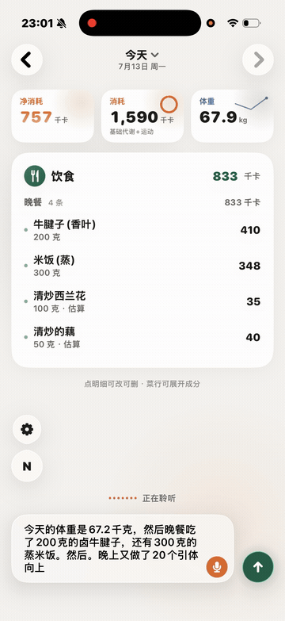
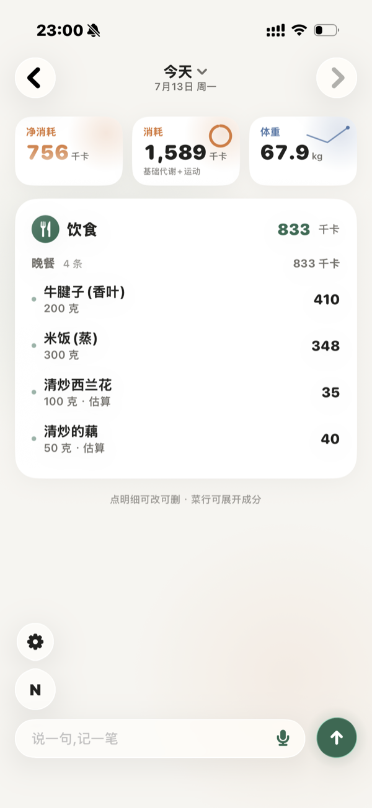
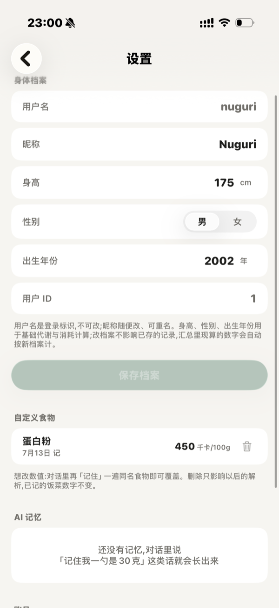

# FitAl

> 一句话，记下吃和练。

FitAl 是一款**自然语言驱动**的健身 / 饮食记录工具。你只需像说话一样输入一句话——「我刚做了 20 个俯卧撑」「中午吃了 200 克鸡胸肉」——应用就会把它解析成结构化的运动 / 饮食 / 体重记录，自动查表计算热量与营养，并汇总每日摄入与消耗。

不用在几十个下拉框里翻找动作、不用查食物库填克重表单。**只记录，不做任何建议、计划或教练式内容。**

<p align="center">
  
</p>

## 在线体验

**https://fital.nuguri.org**（移动端宽度设计，建议用手机打开，或在桌面浏览器里切到手机视图）

演示账号：用户名 `demo1` / 密码 `demo2026`

登进去直接在底部输入框说一句话即可，例如「早上吃了两个鸡蛋和一杯牛奶」「做了 20 个俯卧撑」「今天 70 公斤」。

> 演示账号由所有访客共用，记录彼此可见、也可被他人删除，**请勿填写任何真实的个人信息**。正式使用为邀请码注册制。

## 截图

<table>
  <tr>
    <td align="center"><br/>每日汇总</td>
    <td align="center"><br/>设置 · 身体档案</td>
  </tr>
</table>

## 核心特性

- **零门槛录入**：一句自然语言，不选分类、不填表单；一句话可同时包含多条记录，自动拆分。
- **数据可信、可修**：每条记录标注数据来源（用户自报 / 查表 / 自定义 / AI 估算，视觉可区分），解析错了直接改数字，后端即时重算。
- **聚合交给程序**：练完一组说一组、吃完一顿说一顿，餐次归组、力量场次识别、时长推断、每日汇总全部由后端自动完成。
- **复合菜处理**：报了成分的菜按成分拆解并做克重守恒校验；只报菜名的整菜独立估算，绝不硬拆。
- **修正 MET 消耗模型**：以体重、身高、性别、出生年份估算基础代谢（Mifflin-St Jeor）修正 MET，消耗更贴合个体；总耗 / 净耗双存。
- **体重曲线**：真实时间轴的体重变化趋势。
- **流式语音输入**：点开即说，实时转写回填输入框（服务端中转，密钥不落前端）。
- **多端**：Web（移动端宽度）+ iOS 原生（SwiftUI，液态玻璃）+ 安卓原生（Kotlin + Compose）；三端界面代码各自独立，后端契约通用。

## AI 解析链路

核心设计原则：**LLM 只负责语言理解（解析、口语名映射、复合菜拆解），一切算术与判断规则由后端代码完成。** 数值计算绝不交给模型。

```
自然语言输入
   │
   ▼
① 分诊 ── 切分片段、判定类型（运动 / 饮食 / 体重 / 记忆），提取共享槽位
   │
   ▼
② 专科并发抽取 ── 各类型用各自精简的说明书并发解析
   │             structured output 强约束 + 校验微循环
   │             （不合格带错重试，重试耗尽降级为 AI 估算并标记）
   ▼
③ 纯代码聚合 ── 查表 / 公式计算 / 归组 / 入库，零 AI 参与算术
   │
   ▼
结构化记录（raw 事实层）→ 聚合层（餐次 / 场次）→ 每日汇总
```

**数据来源四级优先级**（每条记录如实标注）：

1. 用户自己报了热量数字 → 直接采用
2. 命中用户的自定义食物表（每 100 克口径，原话精确命中）
3. 命中静态数据表 → LLM 只做口语名 → 标准名映射，数值查表计算
4. 表中没有 → LLM 估算（标记 `llm_estimated`，前端区分展示，可改可删）

**静态数据**：食物成分表约 1600 条（源自《中国食物成分表》第 6 版）+ 运动 MET 表，进程启动时加载为内存字典，精确匹配 + 简单别名匹配；模糊的口语对齐交给 LLM，不做向量检索 / RAG。

**写入 raw 是唯一事实源**：修正 / 删除只落 raw，聚合层可随时从 raw 整层重算。

## 技术栈

| 层 | 技术 |
|---|---|
| 后端 | Python 3.12 · FastAPI · Tortoise ORM · PostgreSQL |
| AI | PydanticAI · 任意 OpenAI 兼容端点（`.env` 可切换，密钥不暴露前端） |
| 语音 | 火山引擎豆包流式语音识别 2.0（服务端中转 WebSocket，逐包 PCM） |
| Web | React · Vite · Tailwind CSS · Lucide · ECharts |
| iOS | SwiftUI · SF Symbols · Swift Charts · 液态玻璃（iOS 26+） |
| 安卓 | Kotlin · Jetpack Compose · Material 3 · OkHttp · DataStore（最低 Android 8.0） |
| 鉴权 | 邀请码注册 + 用户名密码登录 + 不透明令牌（存库，bcrypt 哈希密码） |
| 部署 | Docker 单镜像 · Caddy（自动 HTTPS） |

## 目录结构

```
backend/          FastAPI 后端（自包含依赖，uv 管理）
  app/
    api.py          业务路由
    ai/             解析管线：分诊 / 专科抽取 / 查表计算 / 聚合
    voice/          流式语音中转（WebSocket）
    data/           food.json / met.json 等静态数据
    migrations/     Tortoise 内置迁移
    models.py       数据模型
  scripts/        管理脚本（邀请码 / 重置密码等）
  tests/
web/              React + Vite 前端（移动端宽度）
ios/              SwiftUI 原生 app
android/          Kotlin + Compose 原生 app
docs/             产品定义与项目文档
```

## 本地运行

### 后端

```bash
cd backend
cp .env.example .env      # 填入数据库连接、LLM 端点与密钥
uv sync                   # 安装依赖
uv run tortoise migrate   # 应用数据库迁移
uv run uvicorn app.main:app --reload
```

测试与 lint：

```bash
uv run pytest
uv run ruff check && uv run ruff format
```

### Web

```bash
cd web
npm install
npm run dev               # 开发期 /api 代理到本地后端
```

### 安卓

```bash
cd android
./gradlew assembleDebug     # 调试包，装真机调试
./gradlew assembleRelease   # 分发包，套调试签名，直装不上架
```

产物在 `android/app/build/outputs/apk/`。安装时手机需允许「安装未知来源应用」。

## 部署

**单镜像**：前端构建产物打包进镜像由 FastAPI 一起托管，后端依赖用 uv 安装。

```bash
# 本机交叉构建 amd64 镜像并推送到镜像仓库
docker buildx build --platform linux/amd64 -t <registry>/fital:latest --push .

# 服务器侧拉取并启动（容器启动先跑数据库迁移，再起服务）
docker compose pull && docker compose up -d
```

反向代理（Caddy）负责域名、自动 HTTPS，并放行语音的 WebSocket 升级；前端请求的 `/api` 前缀在代理层剥离后转发到容器。
